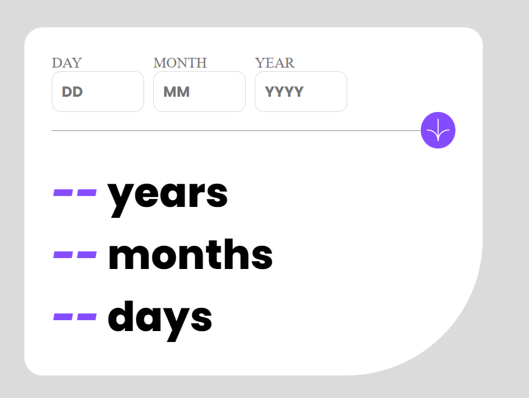

# Frontend Mentor - Age calculator app solution

This is a solution to the [Age calculator app challenge on Frontend Mentor](https://www.frontendmentor.io/challenges/age-calculator-app-dF9DFFpj-Q). Frontend Mentor challenges help you improve your coding skills by building realistic projects. 

## Table of contents

- [Frontend Mentor - Age calculator app solution](#frontend-mentor---age-calculator-app-solution)
  - [Table of contents](#table-of-contents)
  - [Overview](#overview)
    - [The challenge](#the-challenge)
    - [Screenshot](#screenshot)
    - [Links](#links)
  - [My process](#my-process)
    - [Built with](#built-with)
    - [What I learned](#what-i-learned)
  - [Author](#author)


## Overview

### The challenge

Users should be able to:

- View an age in years, months, and days after submitting a valid date through the form
- Receive validation errors if:
  - Any field is empty when the form is submitted
  - The day number is not between 1-31
  - The month number is not between 1-12
  - The year is in the future
  - The date is invalid e.g. 31/04/1991 (there are 30 days in April)
- View the optimal layout for the interface depending on their device's screen size
- See hover and focus states for all interactive elements on the page
- **Bonus**: See the age numbers animate to their final number when the form is submitted

### Screenshot




### Links

- Solution URL: [CODE](https://github.com/AsKing07/age-calculator-app)
- Live Site URL: [DEMO](asking07.github.io/age-calculator-app/)

## My process

### Built with

- Semantic HTML5 markup
- CSS custom properties
- JavaScript


### What I learned

  - Manipulate date with Javascript
  - Sometimes date format causes problems (NaN) on ios devices

Use this section to recap over some of your major learnings while working through this project. Writing these out and providing code samples of areas you want to highlight is a great way to reinforce your own knowledge.

To see how you can add code snippets, see below:


<h1>Some  code I'm proud of</h1>


```js

//Function for calculate age
//dob = date of birth
function calcultAge(dob) {
  const dobObj = new Date(dob);
  const now = new Date();

  let age = now.getFullYear() - dobObj.getFullYear();
  let months = now.getMonth() - dobObj.getMonth();
  let days = now.getDate() - dobObj.getDate();

  if (months < 0 || (months === 0 && days < 0)) {
    age--;
    months = now.getMonth() + 12 - dobObj.getMonth();
  }

  if (days < 0) {
    const lastDayPrecedentMonth = new Date(
      now.getFullYear(),
      now.getMonth(),
      0
    ).getDate();
    days += lastDayPrecedentMonth;
    months--;
  }

  return {
    year: Math.floor(age),
    months: Math.floor(months),
    days: Math.floor(days),
  };
}

//Function to show age
function showAge(age) {
  const showYear = document.getElementById("yearResult");
  const showMonth = document.getElementById("monthResult");
  const showDay = document.getElementById("dayResult");

  animateNumber(showYear, age.year);
  animateNumber(showMonth, age.months);
  animateNumber(showDay, age.days);
}

function animateNumber(element, target) {
  let current = 0;
  if (target === 0) {
    element.textContent = current < 10 ? `0${current}` : current;
  } else {
    const interval = setInterval(() => {
      current++;
      element.textContent = current < 10 ? `0${current}` : current;
      if (current === target) {
        clearInterval(interval);
      }
    }, 100);
  }
}

```


## Author

- Website - [Charbel SONON](https://cutt.ly/charbeldev)
- Frontend Mentor - [@AsKing07](https://www.frontendmentor.io/profile/AsKing07)
- GitHub - [@AsKing07](https://www.github.com/AsKing07)


